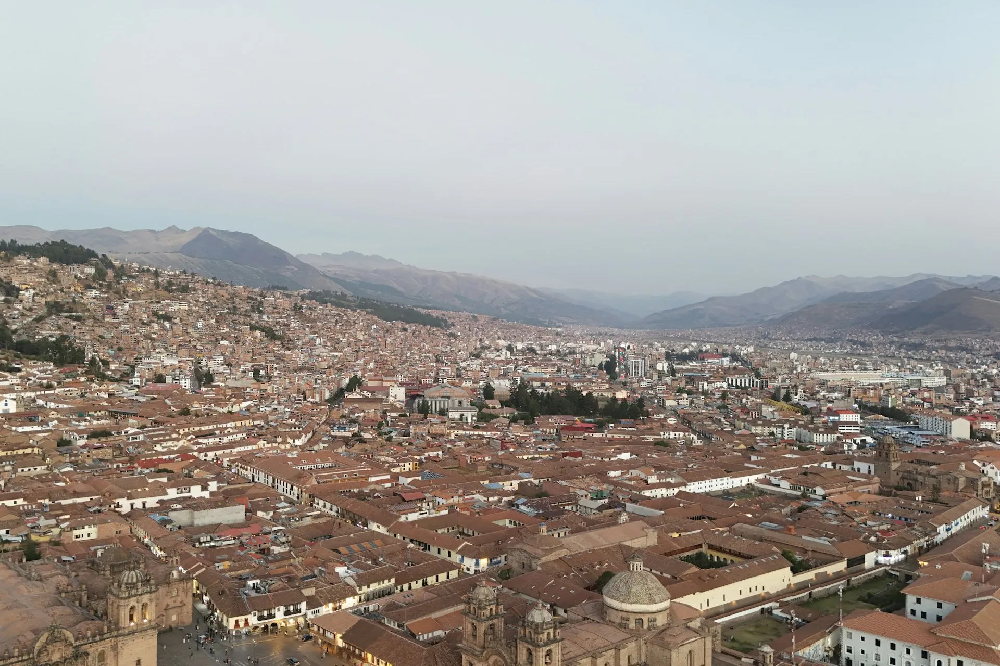

<p align="center">
  
</p>

<h1 align="center">Green Golden Cusco 🏔️</h1>

<p align="center">
  <strong>Agencia de turismo local en Cusco</strong><br />
  Sitio web profesional con tours, blog multilingüe y galería multimedia.
</p>

<p align="center">
  <a href="https://duskalor.github.io/greenGoldenCusco/">🌐 Ver demo</a>
  ·
  <a href="#-stack-tecnológico">Stack</a>
  ·
  <a href="#-estructura">Estructura</a>
  ·
  <a href="#-despliegue">Despliegue</a>
</p>

---

## ✨ Características

| Característica | Detalle |
|---|---|
| 🌐 **3 idiomas** | Español, English, Português (sin i18n routing, todo client-side) |
| 💰 **2 monedas** | Soles (PEN) y Dólares (USD) |
| 🖼️ **Fotos reales** | 10 imágenes Unsplash integradas en todos los componentes |
| 📝 **Blog** | 6 posts traducidos con guías, consejos y comparativas |
| 🎨 **Diseño** | Tailwind CSS v4 con sistema de tema oscuro + dorado |
| ⚡ **Rendimiento** | SSG (100% estático), imágenes optimizadas, 0 functions |
| 📱 **Responsive** | Mobile-first, navbar adaptativa, grid fluido |
| 🔍 **SEO** | Metadata por página, generateStaticParams, sitemap-ready |
| 💬 **WhatsApp** | Botón flotante + CTA en tours con mensaje pre-armado |

## 🛠 Stack Tecnológico

```
Frontend        Next.js 16 + React 19 + TypeScript 6
Estilos         Tailwind CSS v4 + Playfair Display + DM Sans
Estado          React Context (AppContext para lang/currency)
Imágenes        Unsplash (fotografía real de Cusco/Perú)
Deploy          GitHub Actions + GitHub Pages (o Vercel)
Dominio         duskalor.github.io/greenGoldenCusco
```

## 📁 Estructura

```
src/
├── app/                    # Páginas (App Router)
│   ├── blog/               #   /blog y /blog/[slug]
│   ├── tours/              #   /tours y /tours/[id]
│   ├── contacto/           #   /contacto
│   ├── media/              #   /media (galería)
│   ├── nosotros/           #   /nosotros
│   └── page.tsx            #   Home (Hero + Featured + Commitments)
├── components/
│   ├── blog/               # BlogCard
│   ├── layout/             # Navbar, Footer, LangSwitcher, CurrencySwitcher
│   ├── pages/              # ToursClient, TourDetailClient, BlogListClient...
│   ├── sections/           # Hero, FeaturedTours, Commitments, CTASection
│   ├── tours/              # TourCard
│   ├── ui/                 # Button, Card, Badge, Container, Animate...
│   └── providers/          # AppProviders
├── data/
│   ├── tours.ts            # Tour data + images + prices
│   ├── blog.ts             # 18 posts (6 × 3 idiomas)
│   └── translations.ts     # ~1500 líneas de i18n
├── types/                  # Tour, BlogPost, Lang, Currency...
├── lib/                    # whatsapp.ts, utils.ts
├── context/                # AppContext (lang, currency)
└── styles/                 # globals.css (Tailwind v4)
```

## 🌍 Idiomas y Monedas

| Idioma | Nav | Tours | Blog | About | Contact | Gallery |
|---|---|---|---|---|---|---|
| Español | ✅ | ✅ | ✅ | ✅ | ✅ | ✅ |
| English | ✅ | ✅ | ✅ | ✅ | ✅ | ✅ |
| Português | ✅ | ✅ | ✅ | ✅ | ✅ | ✅ |

| Moneda | Tours | TourDetail |
|---|---|---|
| PEN (S/) | ✅ | ✅ |
| USD ($) | ✅ | ✅ |

## 📝 Tours disponibles

| Tour | Duración | Dificultad | Altura |
|---|---|---|---|
| 🏛️ Machu Picchu | Full Day | Moderada | 2,430 m |
| 🌈 Montaña 7 Colores | Full Day | Alta | 5,200 m |
| 💎 Laguna Humantay | Full Day | Moderada | 4,200 m |
| 🏙️ City Tour Cusco | 1/2 Day | Fácil | 3,399 m |
| 🏔️ 7 Lagunas | Full Day | Alta | 4,900 m |
| 🥾 Camino Inca | 4D/3N | Alta | 4,215 m |
| ⛰️ Salkantay | 5D/4N | Alta | 4,600 m |
| 🌄 Lares | 4D/3N | Moderada | 4,400 m |
| 🏔️ Palcoyo | Full Day | Baja | 4,900 m |

## 📖 Blog

| Post | Categoría |
|---|---|
| Cómo aclimatarse a la altura en Cusco | Consejos |
| Machu Picchu: guía completa para tu visita | Guías |
| Montaña 7 Colores vs Palcoyo | Comparativas |
| Mejor época para visitar Cusco | Consejos |
| Camino Inca: todo lo que necesitás saber | Guías |
| Qué llevar para un trekking en los Andes | Consejos |

## 🚀 Despliegue

### GitHub Pages (recomendado — gratis)

```bash
# El deploy es automático con cada push a main
git push origin main

# También podés dispararlo manualmente desde:
# GitHub → Actions → Deploy to GitHub Pages → Run workflow
```

**Configuración necesaria (1 vez):**
1. Repo → Settings → Pages → Source: **GitHub Actions**

### Vercel (alternativa — gratis para hobby)

[](https://vercel.com/new/clone?repository-url=https://github.com/Duskalor/greenGoldenCusco)

```bash
# O importar desde dashboard:
vercel --prod
```

### Local

```bash
npm install
npm run dev     # → http://localhost:3000
npm run build   # → genera out/
```

## 🖼️ Créditos de imágenes

Fotografías de [Unsplash](https://unsplash.com):

| Foto | Autor |
|---|---|
| Cusco aerial (hero) | Kieran Proctor |
| Machu Picchu + clouds | Kieran Proctor |
| Machu Picchu classic | Patrick Federmann |
| Humantay Lake | Cristhian Carreño |
| Rainbow Mountain | Roi Dimor |
| Sacred Valley / Ollantaytambo | Meg von Haartman |
| Cusco Plaza de Armas | José Antonio Morón |
| Peru mountains | Natalie Pedigo |
| Inca Trail | Hiker |

---

<p align="center">
  <sub>Built with ❤️ for Cusco, Perú</sub>
  <br />
  <sub>© 2026 Green Golden Cusco — Todos los derechos reservados</sub>
</p>
